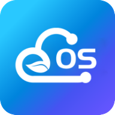
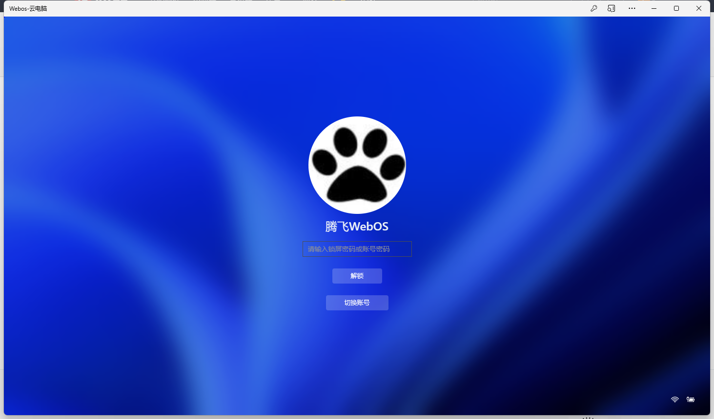
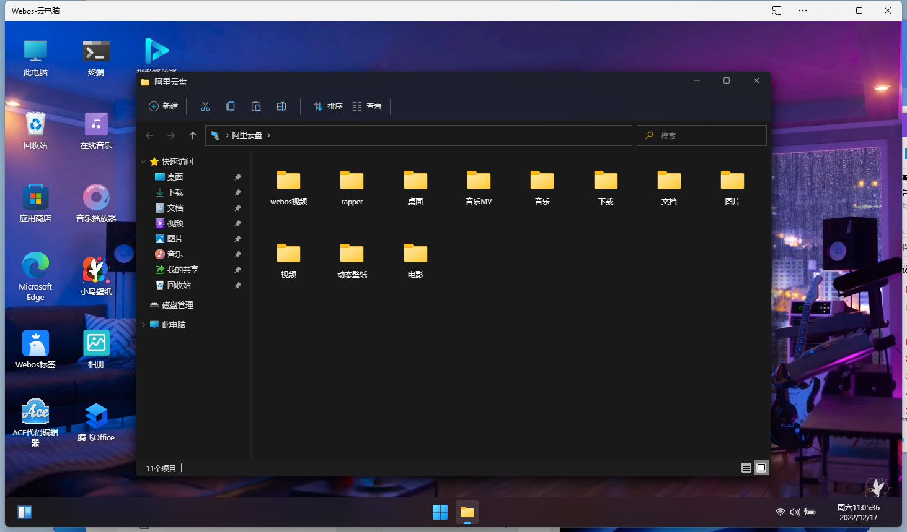
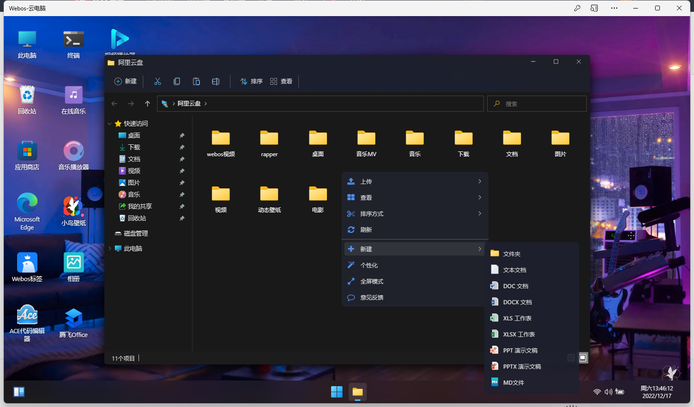
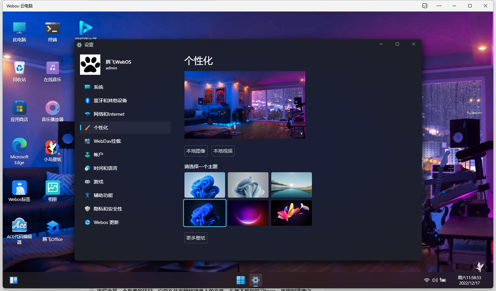
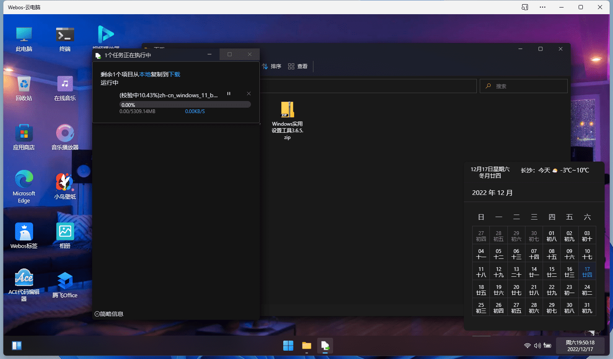
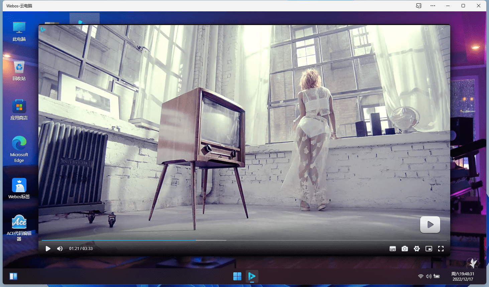
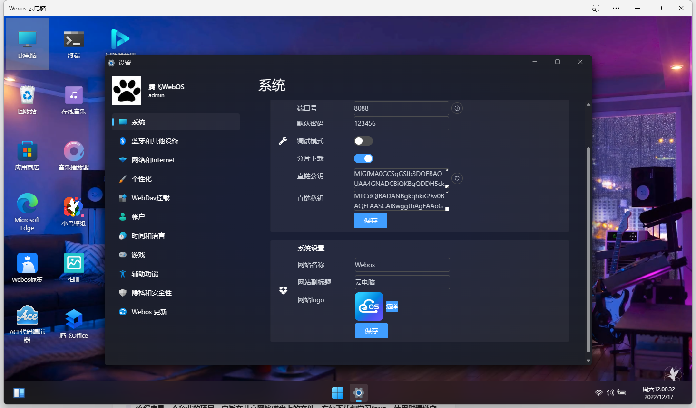
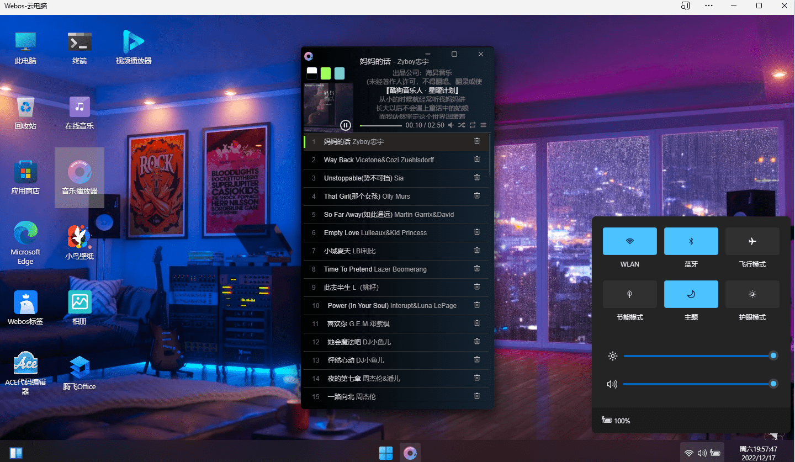

<h1 align="center" style="text-align:center;">

 
WebOS v1.2.4
</h1>

    <strong>更现代感的，私有云、云盘、网盘、NAS</strong>

    <a href="https://support.qq.com/product/464670/">官网</a>
    

### 部署环境

    <a target="_blank" href="https://www.oracle.com/java/technologies/javase/javase-jdk8-downloads.html">
        

### 浏览器支持

### 移动端支持

### PC桌面支持

 

    

Webos是免费的，个人随意部署
全平台兼容性：Win、Linux、Mac (Apache、Nginx、IIS)。从百元级别的智能路由器和盒子产品，到NAS网络存储设备，到服务器面板，服务器，硬件集成，ERP集成，私有云、公有云、SaaS服务搭建等各种场景都可自如适用。

支持跨平台浏览器的无缝访问。仅需一个浏览器即在web端完成文档的上传下载、管理查看，不需要安装任何类似ftp客户端的软件。

## 介绍

WebOS是一个支持多种存储。

云端存储&协同办公新体验 如Windows11体验的私有云盘/企业网盘。

完全支持私有化部署，存储安全可控 数百种文件格式在线预览、编辑和播放 轻松分享。

高效协作，细粒度权限管控全平台客户端覆盖，随时随地访问。

    🛠 动态视频桌面

           💡 本地视频

           💡 网盘视频

           💡 第三方视频

 

    🛠 多个储存方式

           💡 本地硬盘(已上线,双模式:秒传模式/常规模式)           

           💡 阿里云盘(已上线,扫码/验证码/账号登录,直连上传,直连下载)

           💡 天翼云盘(已上线,扫码登录,直连上传,直连下载)

           💡 百度云盘(已上线,扫码/验证码/账号登录,无缓存中转上传,直连下载)

           💡 夸克网盘(已上线,扫码登录,直连上传,直连下载)

           💡 OneDrive(已上线,扫码,验证码,账号登录,无缓存中转上传,直连下载)

           💡 123网盘(已上线,账号登录,直连上传,直连下载)

           💡 可道云(已上线,账号登录,无缓存中转上传,直连下载)

           ⚠️ 后续增加

 

    🛠 支持库

           ❤️ 最新支持终端SSH

           ❤️ 文件预览（PDF、降价、代码、纯文本等）

           ❤️ 图库相册模式下的图像预览

           ❤️ 视频和音频预览，支持歌词和字幕

           ❤️ Office 文档预览/编辑/协同办公 （docx， pptx， xlsx ， ...）

           ❤️ 文件永久链接复制和直接文件下载

           ❤️ 自适应暗模式

           ❤️ 文件/文件夹包下载

           ❤️ 网页上传/下载（删除、mkdir、重命名、移动/复制/剪切/粘贴）

           ❤️ 离线下载（即将支持）

           ❤️ 在两个存储之间复制文件

           ❤️ 全盘断点续传(意外断网,刷新,重新在同一个目录选同一个文件能接着传)

           ❤️ 跨盘秒传(任意盘之间复制粘贴会检测是否支持,不支持采用先下载再上传)

           ❤️ 本地磁盘支持秒传和普通模式(管理员有此能力)

           ❤️ 文件编辑预览(文本,代码,文档,图片等在线编辑和预览,后面会支持更多)

           ❤️ 协同办公(采用金山文档绑定文件支持协同办公)

           ❤️ 拖拽上传(从本地文件拖拽文件或者文件夹到webos中即可上传)

           ❤️ 锁屏能力(离开桌面主动锁屏,防止信息泄露,不影响上传和下载)

           ❤️ 直连上传(全盘支持从浏览器直接上传到服务器,不经过中转)

           ❤️ 直连下载(全盘支持从服务器直接下载文件到本地,不经过中转)

           ❤️ 独立的应用商店（可下载应用插件、后期可注册开发者发布自己制作的插件）

           ❤️ 特定的用户组（管理员-主用户-子用户）

## 官网及相关示例：

* 官网地址：[https://support.qq.com/product/464670](https://support.qq.com/product/464670)
* 官网配套演示：[https://webos.tenfell.cn](https://webos.tenfell.cn)
* 项目单测：`主用户编号:10001`
`账号:test`
`密码:123456`
* 提示：`请不要上传无意义内容，测试号为公开账号，请注意隐私。不要上传违法内容，发现封禁IP`

## 自部署一键安装
* 1.`if [ -f /usr/bin/curl ];then curl -sSO https://plugins.webos.tenfell.cn/webos_update/common/install.sh;else wget -O install.sh https://plugins.webos.tenfell.cn/webos_update/common/install.sh;fi;bash install.sh`
* 2.等待出现欢迎提示语,然后浏览器访问`http://网址:8088`

## 自部署快捷步骤
* 1.`yum install java-1.8.0-openjdk`已有JDK可跳过
* 2.`wget http://plugins.webos.tenfell.cn/webos_update/php/index.php?type=8 -O webos.zip`
* 3.`unzip webos.zip`
* 4.`cd api`
* 5.`sh restart.sh`
* 6.浏览器访问`http://网址:8088`

## 自部署可视化操作步骤
* 1.从发行版下载安装包[点我下载](http://plugins.webos.tenfell.cn/webos_update/php/index.php?type=8) 上传到服务器
* 2.安装好jdk已有jdk可跳过此步骤
* 3.解压webos.zip文件
* 4.进入api目录,启动项目,linux执行`sh restart.sh`,win双击`start.bat`文件
* 5.浏览器访问`http://网址:8088`

## 部分项目演示
登录页  

文件列表  

右键菜单  

个性化  

轻应用  

应用商店  

上传进度  

视频播放  

系统设置  

音乐  

