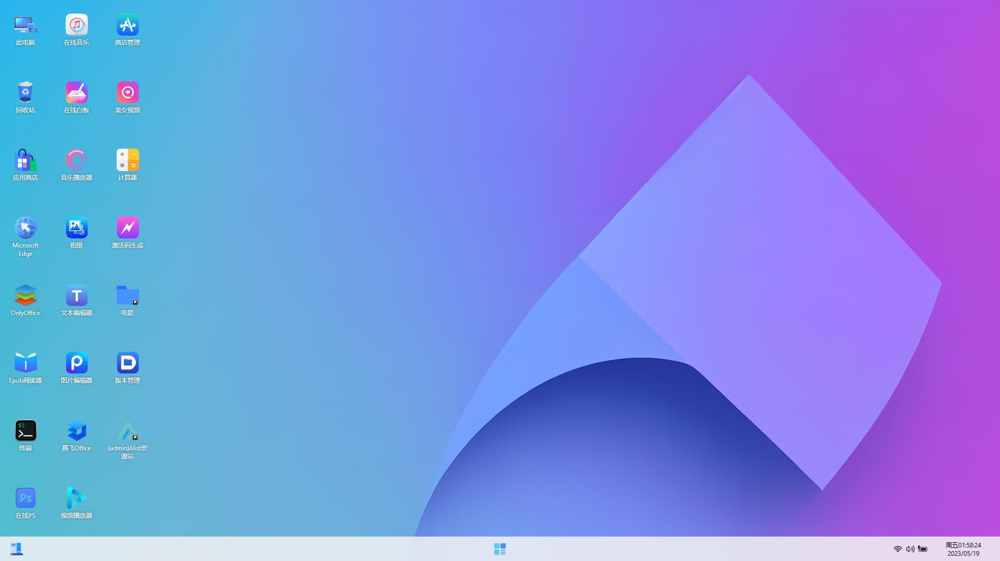
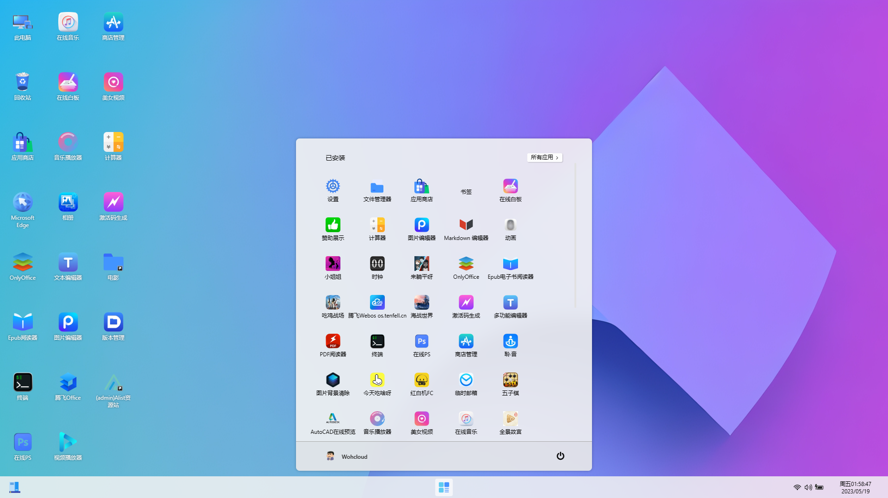
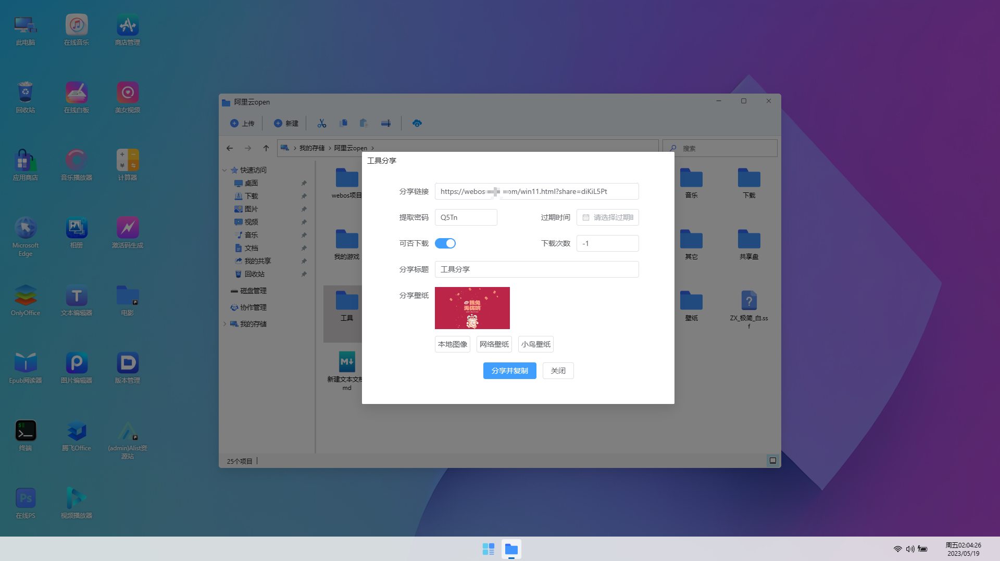

# 仿Windows 11 网页版 私有云
# 腾飞Webos

> 腾飞WebOS是一个支持多种存储。
> 云端存储&协同办公新体验 如Windows11体验的私有云盘/企业网盘。
> 🎉🎉全平台兼容性：Win、Linux、Mac、Docker (Apache、Nginx、IIS)。从百元级别的智能路由器和盒子产品
> 到NAS网络存储设备，到服务器面板，服务器，硬件集成，ERP集成，私有云、公有云、SaaS服务搭建等各种场景都可自如适用
支持跨平台浏览器的无缝访问。仅需一个浏览器即在web端完成文档的上传下载、管理查看，不需要安装任何类似ftp客户端的软件。
> 只需要一个浏览器，三端都能访问 ✨PC✨H5✨ipad🎊🎈`o(^o^)o`

- <a href="https://tfyun.gitee.io/common/jump.html?url=https%3A%2F%2Fos.tenfell.cn" target="_blank">腾飞Webos</a>
  - [前言](#前言)
  - [效果展示](#效果展示)
  - [在线体验](#在线体验)
  - [安装和使用](#安装和使用)
  - [网盘挂载](#网盘挂载)
  - [部分功能](#部分功能)
  - [问答](#问答)

## 前言
腾飞Webos是免费的，个人随意部署，应用商店提供大量插件,且全部免费, <a href="https://tfyun.gitee.io/common/jump.html?url=https%3A%2F%2Fbbs.tenfell.cn%2Fupdate" target="_blank">更新日志</a> ←。

参考API<a href="https://tfyun.gitee.io/common/jump.html?url=https%3A%2F%2Fthoughts.teambition.com%2Fshare%2F64531c70be7a0f004263891d" target="_blank">插件开发</a>  

仿win11的操作习惯，占用内存小，各种高级的功能(支持开发者自行开发插件)
> 安卓、IOS，桌面版火速开发中....... `>v-)o`

## 效果展示
> 每次更新都会对效果作出调整，达到满意为止(你点一下这里查看<a href="https://tfyun.gitee.io/common/jump.html?url=https%3A%2F%2Ftfyun.gitee.io%2Findex.html%3FtoLoginNo%3D10001%26toLoginUser%3Dtest%26toLoginPassword%3D123456" target="_blank">官方演示</a> `-_-)o` )  

*登录*

*桌面*

*开始*

*设置*

*小工具*

*文件管理器*

*上传*

*新建*

*共享*

*文档编辑*

*图片编辑*

*在线音视频*

*休闲娱乐*

*应用商店*

*网盘模式*
## 在线体验

<a href="https://tfyun.gitee.io/common/jump.html?url=https%3A%2F%2Ftfyun.gitee.io%2Findex.html%3FtoLoginNo%3D10001%26toLoginUser%3Dtest%26toLoginPassword%3D123456" target="_blank">在线预览</a>  

## 安装和使用
> 【推荐】万能自动部署一键安装

`if [ -f /usr/bin/curl ];then curl -sSO https://support.tenfell.cn/install.sh;else wget -O install.sh https://support.tenfell.cn/install.sh;fi;bash install.sh`

 win版安装教程<a href="https://tfyun.gitee.io/common/jump.html?url=https%3A%2F%2Fos.tenfell.cn%2Fdoc%2F%23%2Fdoc%2Fwin" target="_blank">点击查看</a>  

linux版部署教程<a href="https://tfyun.gitee.io/common/jump.html?url=https%3A%2F%2Fos.tenfell.cn%2Fdoc%2F%23%2Fdoc%2Flinux" target="_blank">点击查看</a>  

MAC版部署教程<a href="https://tfyun.gitee.io/common/jump.html?url=https%3A%2F%2Fos.tenfell.cn%2Fdoc%2F%23%2Fdoc%2Fmac" target="_blank">点击查看</a>  

宝塔版部署教程<a href="https://tfyun.gitee.io/common/jump.html?url=https%3A%2F%2Fos.tenfell.cn%2Fdoc%2F%23%2Fdoc%2Fbt" target="_blank">点击查看</a>  
 
Docker版部署教程<a href="https://tfyun.gitee.io/common/jump.html?url=https%3A%2F%2Fos.tenfell.cn%2Fdoc%2F%23%2Fdoc%2Fdocker" target="_blank">点击查看</a>  
 
群辉版部署教程<a href="https://tfyun.gitee.io/common/jump.html?url=https%3A%2F%2Fos.tenfell.cn%2Fdoc%2F%23%2Fdoc%2Fqunhui" target="_blank">点击查看</a>  

## 网盘挂载
已支持挂载的部分网盘:
- [√] 阿里云盘
- [√] 天翼云盘
- [√] 百度云盘
- [√] 夸克网盘
- [√] 一刻相册
- [√] 115网盘
- [√] OneDrive
- [√] 123云盘
- [√] WebDav
- [√] 本地磁盘
- [x] 迅雷网盘
- [x] 移动云盘
- [x] 曲奇网盘

## 部分功能
下面是一些常用功能 `~o~)/`
- [√] 第三方登录
- [√] 离线下载
- [√] 网页上传/下载（删除、mkdir、重命名、移动/复制/剪切/粘贴）
- [√] 全盘断点续传(意外断网,刷新,重新在同一个目录选同一个文件能接着传)
- [√] 跨盘秒传(任意盘之间复制粘贴会检测是否支持,不支持采用先下载再上传)
- [√] 文件编辑预览(文本,代码,文档,图片等在线编辑和预览,后面会支持更多)
- [√] 协同办公(采用金山文档绑定文件支持协同办公)
- [√] 直连上传(全盘支持从浏览器直接上传到服务器,不经过中转)
- [√] 直连下载(全盘支持从服务器直接下载文件到本地,不经过中转)
- [√] 独立的应用商店（可下载应用插件、后期可注册开发者发布自己制作的插件）
- [√] 文件永久链接复制和直接文件下载
- [√] 全盘文件分享（可控制是否允许下载）
- [√] 用户权限管控
> 更多功能就不意义介绍了，请到官网体验

## 问答
AD:腾飞webos是干什么的\
AN:腾飞ebos是一款免费的个人私有云

AD:支持什么环境安装部署\
AN:基本支持全平台部署`-_-)o`

AD:我能用webos做什么\
AN:在任何场景下，只需要一个浏览器就能在线办公

AD:腾飞webos后期会收费吗\
AN:腾飞webos对个人用户是免费的，即使是中小企业，
我们提供的方案也够您使用，不会强制转换收费模式。

P:应用商店插件以后会不会收费\
AN:官方提供的插件永不收费，第三方作者自行开发的
插件，我们不保证存在赞助或关注要求。

最近准备重绘图标,大家觉得这个logo怎么样`>_-)o`